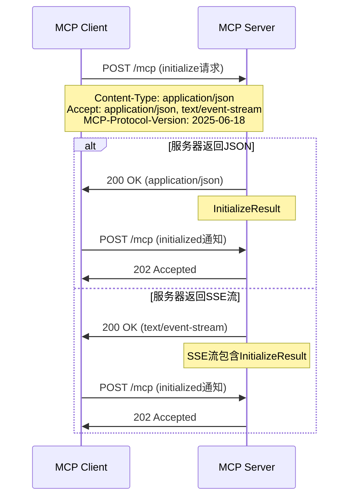

# MCP SSE客户端连接问题修复总结 (第二次修复)

## 问题描述
MCP SSE客户端连接失败，出现重定向循环，状态码从307到308，无法完成握手流程。

## 根本原因分析
1. **协议版本混淆**：代码混用了MCP协议的旧版本(2024-11-05)和新版本(2025-06-18)
2. **错误的端点设计**：按旧协议分离SSE端点(/sse)和消息端点(/messages)，但新协议统一为单一MCP端点
3. **不正确的握手流程**：使用了已废弃的HTTP+SSE传输方式，而非最新的Streamable HTTP传输

## 修复内容

### 1. 协议版本更新
- 统一使用MCP协议版本 `2025-06-18`
- 添加 `MCP-Protocol-Version` 请求头

### 2. 端点架构调整
- **修复前**：分离的端点设计
  ```
  SSE端点: /sse
  消息端点: /messages  
  ```
- **修复后**：统一MCP端点
  ```
  MCP端点: 基础URL (支持POST和GET)
  ```

### 3. 握手流程重构
- **修复前**：
  1. GET请求到/sse建立SSE连接
  2. POST请求到/messages发送initialize
  3. 处理重定向和多个端点

- **修复后**：
  1. POST请求到MCP端点发送initialize请求
  2. 服务器可返回JSON响应或SSE流
  3. 根据Content-Type处理不同类型的响应
  4. POST请求到MCP端点发送initialized通知

### 4. 关键代码修改

#### doConnect()方法
```java
// 修复前
String sseUrl = baseUrl.endsWith("/sse") ? baseUrl : baseUrl + "/sse";

// 修复后  
String sseUrl = baseUrl; // 直接使用基础URL
```

#### performHandshake()方法
```java
// 修复前
String messageUrl = baseUrl.contains("/sse") ? 
    baseUrl.replace("/sse", "/messages") : baseUrl + "/messages";

// 修复后
String mcpEndpoint = baseUrl; // 统一使用MCP端点
```

#### 请求头改进
```java
// 添加协议版本头
initConnection.setRequestProperty("MCP-Protocol-Version", "2025-06-18");
// 支持多种响应类型
initConnection.setRequestProperty("Accept", "application/json, text/event-stream");
```

### 5. 新增功能
- `handleInitializationSSEStream()`: 处理初始化阶段的SSE流
- `readResponseBody()`: 统一读取HTTP响应体
- 改进的错误处理和调试日志

## 符合规范的新流程

### Streamable HTTP传输握手序列


## 预期效果
1. 消除重定向循环问题
2. 正确建立MCP连接
3. 符合最新MCP协议规范
4. 支持多种服务器实现方式

## 测试建议
1. 确认服务器支持MCP 2025-06-18协议
2. 验证服务器MCP端点配置正确
3. 检查服务器是否正确处理统一端点的POST和GET请求
4. 确认服务器返回正确的Content-Type头

## 兼容性说明
此修复专门针对MCP协议2025-06-18版本。如需支持旧版本服务器，需要实现向后兼容性检测逻辑。

---

## 历史问题记录

### 第一次问题：404错误 (已解决)

**问题描述**：
MCP客户端连接遇到404错误，错误信息显示"初始化请求失败，状态码: 404"

**根本原因**：
- **正确的端点**: `/messages/` (带's'，复数形式)
- **代码中使用的端点**: `/message` (不带's'，单数形式)

**修复方案**：
将所有的`/message`端点改为`/messages`

### 第二次问题：307重定向循环 (已解决)

**问题描述**：
修复404问题后发现新问题：
- SSE连接成功（状态码200）
- 但初始化POST请求收到307重定向
- Java的HttpURLConnection默认不自动处理POST请求的重定向

**修复方案**：
通过研究MCP协议规范，发现根本问题是协议版本和握手流程不正确，最终重构了整个握手逻辑。

修复完成时间：2025-08-03