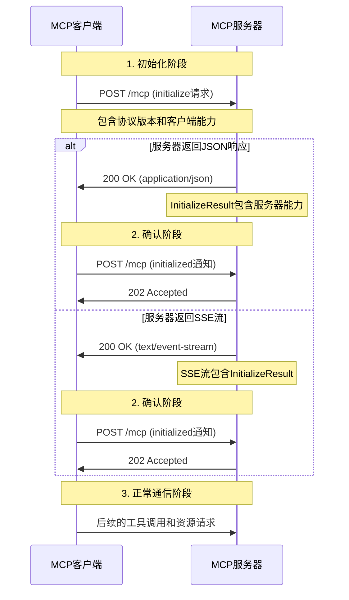

# MCP握手协议规范 (2025-06-18版本)

## 概述

Model Context Protocol (MCP) 使用标准化的握手流程来建立客户端和服务器之间的连接。本文档详细说明了MCP协议2025-06-18版本的Streamable HTTP传输方式的握手流程和请求规范。

## 协议版本

- **当前协议版本**: `2025-06-18`
- **传输方式**: Streamable HTTP
- **消息格式**: JSON-RPC 2.0
- **字符编码**: UTF-8

## 握手流程概述



## 详细握手步骤

### 第一步：发送初始化请求

客户端向MCP端点发送HTTP POST请求以启动握手。

**请求格式**:
```http
POST /mcp HTTP/1.1
Host: example.com
Content-Type: application/json
Accept: application/json, text/event-stream
MCP-Protocol-Version: 2025-06-18
Cache-Control: no-cache

{
  "jsonrpc": "2.0",
  "method": "initialize",
  "params": {
    "protocolVersion": "2025-06-18",
    "capabilities": {
      "tools": {},
      "resources": {},
      "prompts": {}
    },
    "clientInfo": {
      "name": "YourClientName",
      "version": "1.0.0"
    }
  },
  "id": "init-1234567890"
}
```

**必需的请求头**:
- `Content-Type: application/json`
- `Accept: application/json, text/event-stream`
- `MCP-Protocol-Version: 2025-06-18`

**请求参数说明**:
- `protocolVersion`: 必须为 `"2025-06-18"`
- `capabilities`: 客户端支持的能力声明
- `clientInfo`: 客户端信息（名称和版本）
- `id`: 唯一请求标识符

### 第二步：处理服务器响应

服务器可以返回两种类型的响应：

#### 选项A：JSON响应
```http
HTTP/1.1 200 OK
Content-Type: application/json
Mcp-Session-Id: session-123456

{
  "jsonrpc": "2.0",
  "result": {
    "protocolVersion": "2025-06-18",
    "capabilities": {
      "tools": {
        "listChanged": true
      },
      "resources": {
        "subscribe": true,
        "listChanged": true
      },
      "prompts": {
        "listChanged": true
      }
    },
    "serverInfo": {
      "name": "MyMCPServer",
      "version": "1.0.0"
    }
  },
  "id": "init-1234567890"
}
```

#### 选项B：SSE流响应
```http
HTTP/1.1 200 OK
Content-Type: text/event-stream
Mcp-Session-Id: session-123456
Cache-Control: no-cache

id: 1
event: message
data: {"jsonrpc":"2.0","result":{"protocolVersion":"2025-06-18","capabilities":{"tools":{"listChanged":true}},"serverInfo":{"name":"MyMCPServer","version":"1.0.0"}},"id":"init-1234567890"}

```

### 第三步：发送初始化完成通知

收到`InitializeResult`后，客户端必须发送`initialized`通知确认握手完成。

**请求格式**:
```http
POST /mcp HTTP/1.1
Host: example.com
Content-Type: application/json
MCP-Protocol-Version: 2025-06-18
Mcp-Session-Id: session-123456

{
  "jsonrpc": "2.0",
  "method": "initialized"
}
```

**服务器响应**:
```http
HTTP/1.1 202 Accepted
```

## 会话管理

### 会话ID

如果服务器在初始化响应中包含`Mcp-Session-Id`头，客户端必须在所有后续请求中包含此会话ID。

**示例**:
```http
Mcp-Session-Id: session-123456
```

### 会话终止

客户端可以发送HTTP DELETE请求来明确终止会话：

```http
DELETE /mcp HTTP/1.1
Host: example.com
Mcp-Session-Id: session-123456
```

服务器响应：
- `200 OK`: 会话成功终止
- `405 Method Not Allowed`: 服务器不支持客户端主动终止会话

## 错误处理

### 初始化失败

如果初始化失败，服务器返回错误响应：

```http
HTTP/1.1 400 Bad Request
Content-Type: application/json

{
  "jsonrpc": "2.0",
  "error": {
    "code": -32602,
    "message": "Invalid params",
    "data": "Unsupported protocol version"
  },
  "id": "init-1234567890"
}
```

### 协议版本不匹配

如果协议版本不支持：

```http
HTTP/1.1 400 Bad Request
Content-Type: application/json

{
  "error": "Unsupported MCP protocol version"
}
```

### 会话过期

如果会话ID无效或过期：

```http
HTTP/1.1 404 Not Found
Content-Type: application/json

{
  "error": "Session not found or expired"
}
```

## 安全考虑

### Origin验证

服务器必须验证`Origin`请求头以防止DNS重新绑定攻击：

```java
String origin = request.getHeader("Origin");
if (origin != null && !isAllowedOrigin(origin)) {
    return new ResponseEntity<>(HttpStatus.FORBIDDEN);
}
```

### 本地绑定

本地服务器应该只绑定到localhost：

```java
// 正确：只绑定本地
server.bind(new InetSocketAddress("127.0.0.1", port));

// 错误：绑定所有接口（安全风险）
server.bind(new InetSocketAddress("0.0.0.0", port));
```

## 兼容性

### 向后兼容

新版客户端可以通过以下方式支持旧版服务器：

1. 首先尝试新协议握手
2. 如果失败（404/405），尝试旧协议握手
3. 根据响应确定使用的协议版本

### 协议检测示例

```java
// 尝试新协议
try {
    response = sendInitializeRequest(mcpEndpoint, "2025-06-18");
    if (response.getStatusCode() == 200) {
        // 使用新协议
        return handleNewProtocol(response);
    }
} catch (Exception e) {
    // 尝试旧协议
    return fallbackToOldProtocol();
}
```

## 实现清单

### 客户端实现要求

- [ ] 发送正确的协议版本头 (`MCP-Protocol-Version: 2025-06-18`)
- [ ] 支持`Accept`头包含多种内容类型
- [ ] 处理JSON和SSE两种响应类型
- [ ] 管理会话ID（如果提供）
- [ ] 实现适当的错误处理
- [ ] 支持会话终止

### 服务器实现要求

- [ ] 验证协议版本
- [ ] 支持统一MCP端点（POST和GET）
- [ ] 返回适当的`Content-Type`
- [ ] 实现会话管理（可选）
- [ ] 验证Origin头（安全）
- [ ] 处理初始化和确认消息

## 测试用例

### 基本握手测试

```java
@Test
public void testBasicHandshake() {
    // 1. 发送初始化请求
    InitializeRequest request = new InitializeRequest()
        .protocolVersion("2025-06-18")
        .clientInfo("TestClient", "1.0.0");
    
    HttpResponse response = client.post("/mcp", request);
    
    // 2. 验证响应
    assertEquals(200, response.getStatusCode());
    InitializeResult result = response.parseBody(InitializeResult.class);
    assertEquals("2025-06-18", result.getProtocolVersion());
    
    // 3. 发送确认通知
    HttpResponse confirmResponse = client.post("/mcp", new InitializedNotification());
    assertEquals(202, confirmResponse.getStatusCode());
}
```

### SSE响应测试

```java
@Test
public void testSSEResponse() {
    // 配置接受SSE
    HttpHeaders headers = new HttpHeaders();
    headers.set("Accept", "text/event-stream");
    
    // 发送请求并处理SSE流
    SSEEventSource eventSource = client.createEventSource("/mcp", headers);
    eventSource.onMessage(event -> {
        if (event.getData().contains("InitializeResult")) {
            // 处理初始化响应
            handleInitializeResult(event.getData());
        }
    });
}
```

## 参考资料

- [MCP官方规范](https://modelcontextprotocol.io/specification/2025-06-18/)
- [JSON-RPC 2.0规范](https://www.jsonrpc.org/specification)
- [Server-Sent Events规范](https://html.spec.whatwg.org/multipage/server-sent-events.html)
- [HTTP/1.1规范](https://tools.ietf.org/html/rfc7231)

---

*最后更新: 2025-08-03*
*协议版本: 2025-06-18*